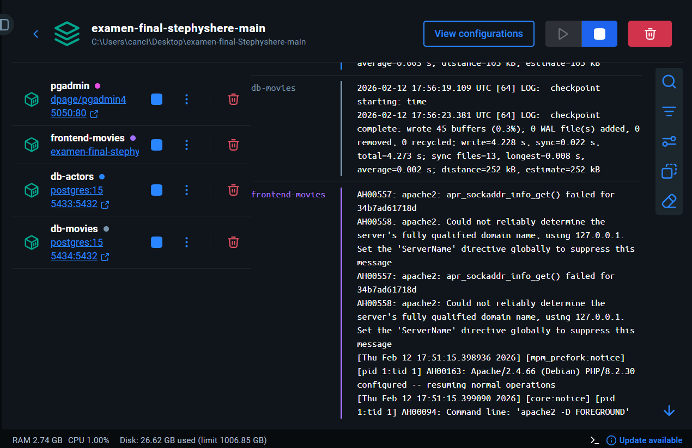
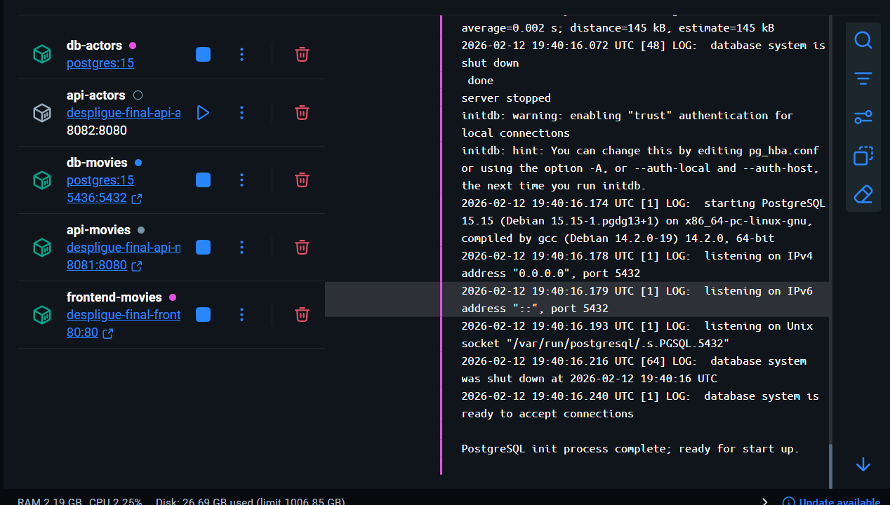
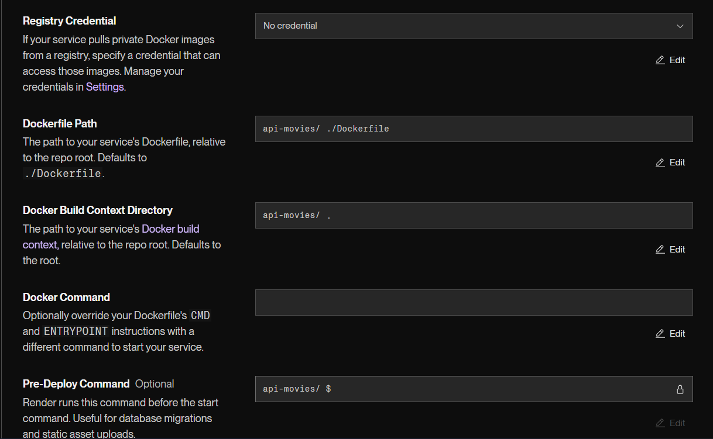
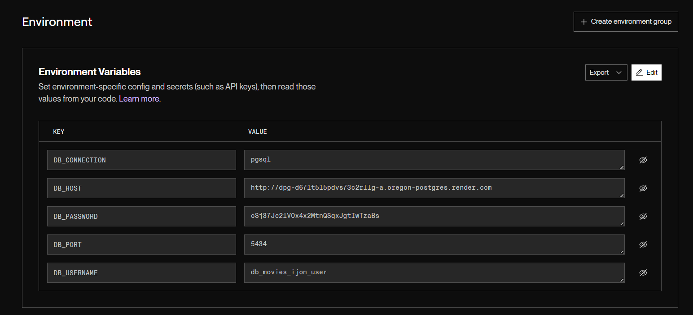
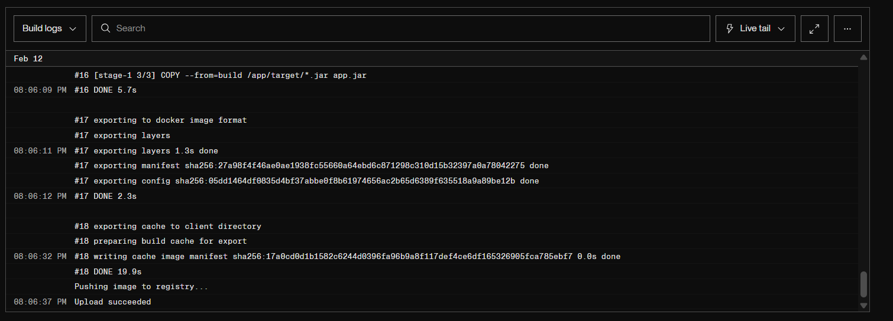
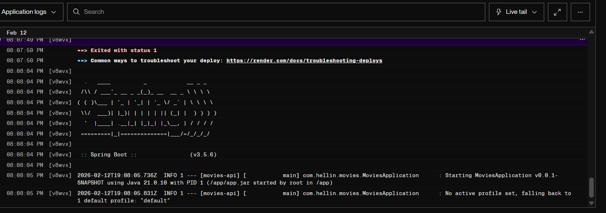
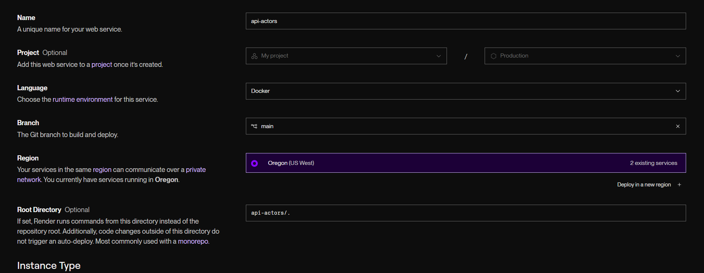

# IMPLEMENTATION.md

## 1. Datos del Alumno

**Nombre completo:** Estefania Castellanos Rodriguez

---

## 2. Entorno LOCAL

### Descripción
En nuestro proyecto en local corren un total de 5 servicios: 
- La base de datos peliculas (db-movies)
- La base de datos de actores (db-actors)
- El frontend de las peliculas (frontend-movies)
- Un gestor de la base de datos (pgAdmin)
- La red Docker, que junta todas las conexiones en una sola.

### Capturas de Ejecución

**⚠️ IMPORTANTE:** Añade todas las capturas que consideres necesarias. Cuanto más completo esté este documento, mejor puntuación obtendrás.

**Docker containers corriendo:**



**Backend API funcionando (Postman/navegador):**


**phpMyAdmin con datos cargados:**


**[Añade aquí más capturas que consideres relevantes]**

### URLs de Acceso
- Backend: `http://localhost:8080`
- phpMyAdmin: `http://localhost:XXXX`
- MySQL: `localhost:3306`

---

## 3. Entorno DEV

### Descripción
En DEV creamos otros 5 servicios distintos mediante Docker:
- Base de datos de movies.
- Base de datos de actors.
- API de peliculas.
- API de actores.
- Frontend.

### Configuración Postgre


**Dashboard :**



**Datos de conexión utilizados:**

![]](images/pre-mariadb-connection.png)

**Connection String utilizado:**
```
jdbc:mysql://serverless-us-east4.sysp0000.db2.skysql.com:4043/series?useSSL=true&requireSSL=true
```

**Tablas y datos en MariaDB SkySQL:**


### Capturas de Ejecución

**Docker containers corriendo:**


**API funcionando (Postman/navegador):**


**Logs del backend conectándose a MariaDB:**


**[Añade aquí más capturas que consideres relevantes]**

### URLs de Acceso
- Frontend Stranger: `http://localhost:XXXX`
- Frontend Dragon: `http://localhost:XXXX`
- Backend: `http://localhost:XXXX`

---

## 4. Despliegue en Render

### URLs Públicas de los Servicios

**⚠️ CRÍTICO:** Las URLs públicas y las capturas de configuración de Render son OBLIGATORIAS y muy importantes para la puntuación.

**Backend API:**
- URL: `https://series-backend-XXXXX.onrender.com`

**Frontend Stranger Things:**
- URL: `https://series-frontend-stranger-XXXXX.onrender.com`

**Frontend House of the Dragon:**
- URL: `https://series-frontend-dragon-XXXXX.onrender.com`

### Capturas de Render

**Dashboard con listado de servicios desplegados:**


### Configuración Backend en Render

**Configuración general del servicio backend:**



**Variables de entorno - Backend:**



**Build logs del backend:**



**Logs de ejecución del backend:**



### Configuración Frontend Stranger en Render

**Configuración general del servicio:**


**Variables de entorno - Frontend Stranger:**


**Build logs:**


### Configuración API-ACTORS en Render

**Configuración general del servicio:**



**Variables de entorno - Frontend Dragon:**


**Build logs:**


### Aplicación Funcionando en Producción

**Frontend Stranger Things (URL pública):**


**Frontend House of the Dragon (URL pública):**


**API funcionando (Postman/navegador - URL pública):**


**Prueba de endpoints con datos reales:**


**[Añade aquí todas las capturas adicionales que consideres relevantes]**

---

## 5. Notas Adicionales


### Nota 1

**Descripción:**
Mayormente, mi mayor problema es cuando me dan 40 errores y no entiendo como arreglarlo. Lo leo, pero aunque pruebe cosas no consigo arreglarlo del todo.
He probado muchas veces en casa a hacer esto sola (o al menos sin que me digan que hacer, cuando, y donde) y aunque así es como mas he aprendido, se me siguen escapando cosillas.

---


## 6. Reflexión Personal

**¿Qué te ha parecido el examen? ¿Qué has aprendido? ¿Qué ha sido lo más difícil?**

aunque a lo largo de estos meses he aprendido a solucionar muchos errores, me doy cuenta de que hay cosas que no entiendo por qué hago o para qué son. 
La verdad es que le he echado bastantes horas a esta asignatura, y no siento haber avanzado lo suficiente 😅😓😭
Estaria bien que le echases un ojo al codigo, y no puntues solo con "funciona" o "no funciona", porque yo ya se cuando no se levanta algo, pero quiero saber el porqué. Se que no está para el 8 siquiera, porfi con el 5 me conformo jaj.
---
